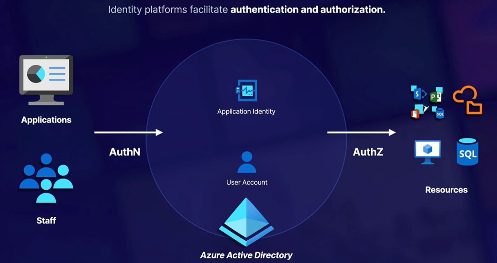
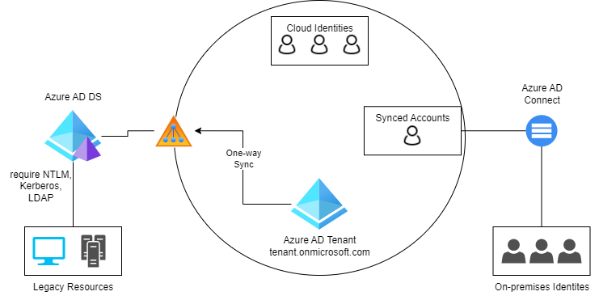
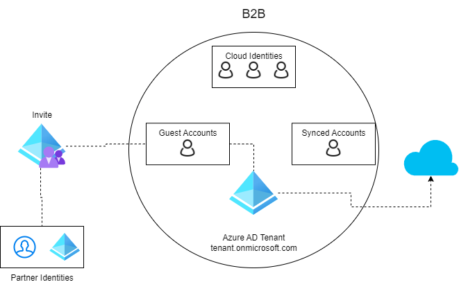

# Identity, Governance and Monitoring README

Azure Active Directory is at the heart of everything when it comes to Authentication (AuthN) and Authorization(AuthZ).

---

## Azure AD Refresh!

### Azure AD Tenant

Azure Active Directory (Azure AD) is a cloud-based identity and access management service. Azure AD enables your employees access external resources, such as Microsoft 365, the Azure portal, and thousands of other SaaS applications.

All Azure subscriptions have a trust relationship with an Azure Active Directory (Azure AD) instance. Subscriptions rely on their trusted Azure AD to authenticate and authorize security principals and devices.

When a user signs up for a Microsoft cloud service, a new Azure AD tenant is created and the user is made a member of the Global Administrator role. However, when an owner of a subscription joins their subscription to an existing tenant, the owner isn't assigned to the Global Administrator role.

> **Important**: When a subscription is associated with a different directory, users who have roles assigned using Azure role-based access control lose their access. Classic subscription administrators, including Service Administrator and Co-Administrators, also lose access. Moving your Azure Kubernetes Service (AKS) cluster to a different subscription, or moving the cluster-owning subscription to a new tenant, causes the cluster to lose functionality due to lost role assignments and service principal's rights.

Click [here](https://learn.microsoft.com/en-us/training/modules/explore-basic-services-identity-types/3-describe-available-editions) to see the differnet licenses for Azure AD.

### Identities

Azure AD manages different types of identities: **users, service principals, managed identities, and devices**.

<u>**User**</u>

A user identity is a representation of something that's managed by Azure AD. Employees and guests are represented as users in Azure AD. If you have several users with the same access needs, you can create a group. You use groups to give access permissions to all members of the group, instead of having to assign access rights individually.

<u>**Service Principals**</u>

A service principal is, essentially, an identity for an application. For an application to delegate its identity and access functions to Azure AD, the application must first be registered with Azure AD to enable its integration. Once registered, a service principal is created in each Azure AD tenant where the application is used. The service principal enables core features such as authentication and authorization of the application to resources that are secured by the Azure AD tenant.

[<u>**Managed Identities**</u>](https://learn.microsoft.com/en-us/training/modules/explore-basic-services-identity-types/4-describe-identity-types)

Managed identities are a type of service principal that are automatically managed in Azure AD and eliminate the need for developers to manage credentials. Managed identities provide an identity for applications to use when connecting to Azure resources that support Azure AD authentication and can be used without any extra cost.

There are 2 types of managed identities: system-assigned and user-assigned.

1. **Syste-Assigned** - When you enable a system-assigned managed identity, an identity is created in Azure AD that's tied to the lifecycle of that service instance. When the resource is deleted, Azure automatically deletes the identity for you
1. **User-Assigned** - You may also create a managed identity as a standalone Azure resource. Once you create a user-assigned managed identity you can assign it to one or more instances of an Azure service.

<u>**Device**</u> - 

A device identity gives administrators information they can use when making access or configuration decisions. Device identities can be set up in different ways in Azure AD.
* **Azure AD registered devices** - The goal of Azure AD registered devices is to provide users with support for bring your own device (BYOD) or mobile device scenarios. In these scenarios, a user can access your organization’s resources using a personal device. 
* **Azure AD Joined** - An Azure AD joined device is a device joined to Azure AD through an organizational account, which is then used to sign in to the device. Azure AD joined devices are generally owned by the organization.
* **Hybrid Azure AD Joined device** - These devices are joined to your on-premises Active Directory and Azure AD requiring organizational account to sign in to the device

### [Groups](https://learn.microsoft.com/en-us/azure/active-directory/fundamentals/concept-learn-about-groups)

With Azure AD groups, you can grant access and permissions to a group of users instead of for each individual user.

There are two group types and three group membership types.

**Group Types**
* **Security** - Used to manage user and compute access to shared resources.
* **Microsoft 365** - Provides collaboration opportunities by giving group members access to a shared mailbox, calendar, files, SharePoint sites, and more.

**Membership Types**
* **Assigned** - Lets you add specific users as members of a group and have unique permissions.
* **Dynamic User** - Lets you use dynamic membership rules to automatically add and remove members. Uses the `attributes` keys. If a member's attributes change, the system looks at your dynamic group rules for the directory to see if the member meets the rule requirements (is added), or no longer meets the rules requirements (is removed). *<b>Requires Azure AD Premium 1 licensing</b>*
* **Dynamic Device** - Lets you use dynamic group rules to automatically add and remove devices.
>**Important** - You can create a dynamic create for either device or users, but not both.

---

# Understanding Azure AD Hybrid Identities

## Azure AD Connect
* Sychronizing identities facilitates single sign-on for accessing resources.
* Authentication Management - Azure AD connect can alter where authentication occurs.
* Azure AD Connect Methods - Azure AD connect sync and Azure AD Connect cloud sync (newer).

## Azure AD Domain Service

* Azure AD is built for modern authentication and authorization.
* Azure ADDS is for legacy resources that may depend on traditional AD Domain service features.
* Support domain join, group policy, LDAP and Kerberos/NTLM authentication.

---

# Azure AD & External Identities

External identities help provide customers and partners with access to resources.

## [Azure AD B2B](https://learn.microsoft.com/en-us/azure/active-directory/external-identities/what-is-b2b)

Azure Active Directory (Azure AD) B2B collaboration is a feature within External Identities that lets you invite guest users to collaborate with your organization.

A simple invitation and redemption process lets partners use their own credentials to access your company's resources.

## [Azure AD B2C](https://learn.microsoft.com/en-us/azure/active-directory-b2c/overview)

Azure AD B2C is a separate service from Azure Active Directory (Azure AD). It is built on the same technology as Azure AD but for a different purpose. It allows businesses to build customer facing applications, and then allow anyone to sign-up and into those applications with no restrictions on user account.

* Create an entirely new AZ AD tenant.
* This tenant is dedicated to the application for authentication.

## [Azure AD External Identities](https://learn.microsoft.com/en-us/azure/active-directory/external-identities/external-identities-overview)

Azure AD External Identities refers to all the ways you can securely interact with users outside of your organization. If you want to collaborate with partners, distributors, suppliers, or vendors, you can share your resources and define how your internal users can access external organizations.

With External Identities, external users can "bring their own identities." Whether they have a corporate or government-issued digital identity, or an unmanaged social identity like Google or Facebook, they can use their own credentials to sign in. The external user’s identity provider manages their identity, and you manage access to your apps with Azure AD or Azure AD B2C to keep your resources protected.

* External identities are a progression and combination of **BOTH** Azure AD B2C and B2B!!

---

# Azure Roles and AD Roles

## Describing RBAC

- Who = Security Principals - could be a single identity, a group, a service principal, or managed identity
- What = Roles Definiation and permissions - Use of built-in roles likes Owner/Contributor and VM Contributor / Custom Role
- Where = Scope - applied at the Management Group, Subscription, RG or Resource.

Principals (Users) are assigned roles which then give them permissions to designated resources.

## Describe Azure Roles

> **Note**: Remember permissions flow down the hierarchy. 

**Common Roles**
| Built-in "General" Roles | Description |
| --- | --- |
| **Owner** | Grants full access to manage all resources, including the ability to assign roles in Azure RBAC. |
| **Contributor** | Grants full access to manage all resources, but does not allow you to assign roles in Azure RBAC, manage assignments in Azure Blueprints, or share image galleries. |
| **Reader** | View all resources, but does not allow you to make any changes. |
| **User Access Administrator** | Lets you manage user access to Azure resources. |

Other common roles used:

- `Virtual Machine Contributor` - Create and manage virtual machines, manage disks, install software, reset password of the root VM. Does not grant management access to VNet or storage account. This role does not allow you to assign roles in Azure RBAC.
- `Storage Account Contributor` - Permits management of storage accounts. Provides access to the account key, which can be used to access data via Shared Key authorization.
- `Network Contributor` - Lets you manage networks, but not access to them.
- `Security Reader` - View permissions for Microsoft Defender for Cloud. Can view recommendations, alerts, a security policy, and security states, but cannot make changes.

[Full list of Azure RBAC roles here.](https://learn.microsoft.com/en-us/azure/role-based-access-control/built-in-roles)

## Describe Azure AD Roles

**Common Roles**
- `global administrator` - Can manage ALL Azure AD resources
- `billing administrator` - Can perform billing tasks
- `user administrator` - Can manage users and groups
- `help desk administrator` - Can reset passwords for users
- `global reader` - Can read everything a global admin can, but not update anything

[Full list here](https://docs.microsoft.com/en-us/azure/active-directory/roles/permissions-reference)

## Azure Roles vs Azure AD Roles

| Azure AD Roles                                                             | Azure Roles                                                    |
|----------------------------------------------------------------------------|----------------------------------------------------------------|
| Manage access to Azure AD resources                                        | Manage access to Azure Resources                               |
| Scope is at tenant level                                                   | Scope can be at multiple levels                                |
| Supports custom roles                                                      | Supports custom roles                                          |
| Main Roles: - Global Admins - User Admins - Billing Admins - Global Reader | Main Roles: - Owner - Contributor - Reader - User Access Admin |

## Custom Roles

You can create custom roles in Azure  and in Azure AD

### Azure Custom Roles

If the Azure built-in roles don't meet the specific needs of your organization, you can create your own custom roles. Just like built-in roles, you can assign custom roles to users, groups, and service principals at management group (in preview only), subscription, and resource group scopes.

Custom roles can be shared between subscriptions that trust the same Azure AD tenant. There is a limit of 5,000 custom roles per tenant. 

### Azure Active Directory Custom Roles

Granting permission using custom Azure AD roles is a two-step process that involves creating a custom role definition and then assigning it using a role assignment. A custom role definition is a collection of permissions that you add from a preset list.

A role assignment is an Azure AD resource that attaches a role definition to a security principal at a particular scope to grant access to Azure AD resources.

#### Example

The following diagram shows an example of a role assignment. In this example, Chris has been assigned the App Registration Administrator custom role at the scope of the Contoso Widget Builder app registration. The assignment grants Chris the permissions of the App Registration Administrator role for only this specific app registration.

